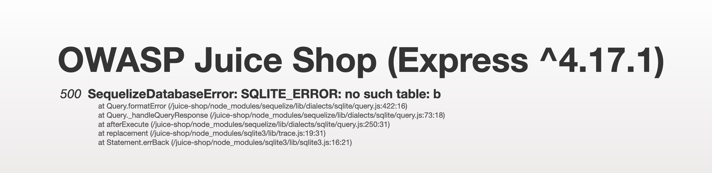
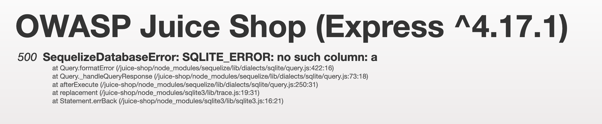
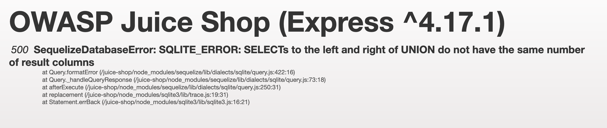

# Week 2 - 4-Star Juice Shop Injection Challenge 

Sasha Thomas

April 12th 2020

## Introduction and Materials

This week, our task was to pick and complete a 4-star challenge in juice shop. I chose retrieving a list of all user credentials via SQL injection. As with the last lab, I just used chrome and firefox to complete it. 

## Steps to Reproduce

1. Going into this challenge, I didn't have a good idea where to start. Retrieving a list of user credentials felt ambiguous in terms of where on the site I would do this. I started by trying to understand the log-in/log-out system, and create account system. Where was this being posted to? What information was being sent? Could I see it? My reconaissance gave me some interesting information.

   1. First, upon creation of an account, JSON containing account information is sent as a POST request to `/api/users`:

      ```json
      {
       status: "success", 
       data: {
         username: ""
         role: "customer"
         deluxeToken: ""
         lastLoginIp: "0.0.0.0"
         profileImage: "/assets/public/images/uploads/default.svg"
         isActive: true
         id: 19
         email: "hello1234@gmail.com"
         updatedAt: "2020-04-13T00:32:22.581Z"
         createdAt: "2020-04-13T00:32:22.581Z"
         deletedAt: null
        }
      }
      ```

   2. Second, upon logging in, a GET request is sent to `/rest/user/whoami`, and a POST request is sent `/rest/user/login`. Trying to hit those URLs in my browser gave me an authentication error, and the JSON in the body of the requests didn't give me any clues about where to go. 

   3. Lastly, upon logging out, a GET request is sent to `/rest/saveLoginIp`. The JSON in the body contained the following juicy information:

      ```json
      {
        id: 19
        username: ""
        email: "hello1234@gmail.com"
        password: [redacted]
        role: "customer"
        deluxeToken: ""
        lastLoginIp: "undefined"
        profileImage: "/assets/public/images/uploads/default.svg"
        totpSecret: ""
        isActive: true
        createdAt: "2020-04-13T00:32:22.581Z"
        updatedAt: "2020-04-13T00:46:29.174Z"
        deletedAt: null
      }
      ```

      Although I couldn't access `/rest/saveLoginIp` directly either, this was definitely the kind of information I was looking for. Maybe it was related?

2. At this point, the only way I knew I could interact directly with the API was through the vulnerable product search from our last lab (located at `/rest/products/search?q`). The explanation of the challenge recommends looking into `UNION SELECT` in order to complete this challenge. Connecting the dots, I realized that my attack vector could still be the vulnerable product search page. A `UNION SELECT` could grab information from a different table, say one holding credentials, even if the site thinks I'm looking for products.

3. From this point, I spent lots of time hopping from one error to another. My first couple queries were met with syntax errors, until I moved my `UNION SELECT` completely outside of my parenthesis. The string `search?q=')) UNION SELECT a from b--` resulted in the following error:

   

   I was happy to see this error, because it told me that the API was correctly reading my `UNION SELECT`. However, this is where I ran into a wall. How could I know the name of the table, or even the column headers? I spent more time than I'd like to admit trying to figure out how to enumerate the table names. Eventually, I tried some common table names I found, and `users` worked. Not the most elegant solution... In retrospect, my reconaissance actually gave me this answer. As I mentioned, creating an account results in a POST request being sent to `/api/users`. `search?q=')) UNION SELECT a from users--` resulted in the following error:

   

5. From this, I knew a table called `users` existed, I just needed to enumerate the column names. I figured username or password had to be in there somewhere, so I tried the following string: `search?q=')) UNION SELECT username, password from users--` and was met with an error I didn't expect:

   

   What? After some googling and stack-exchanging, I learned that `UNION SELECT` requires both tables to have the same number of columns. Which makes sense, because when you combine two tables top-to-bottom, a column can't be missing. It was attempting to combine two columns from the `users` table to the `products` table, which I already knew had 9 columns, because I could see 9 JSON keys. My options then were to force feed  dummy information for it to fill the columns with, or find 7 other columns in the `users` table. 

6. I decided to force feed it information. I wasn't sure if it was expecting certain types of data for certain products. For example, if my dummy data held a string, and the column was price, I was afraid that it would expect a number and see a string. Because of this, I tried entering `null` values for the rest of the columns in hopes that it would avoid this problem. However, it resulted in an error that didn't make any sense to me, even with googling. It seemed like it was outside of the scope of the problem, so on a whim, I tried entering 7 strings, and this actually worked. My SQL string at this point was `search?q=')) UNION SELECT username, password, "", "", "", "", "", "", "" from users--`, and finally I was welcomed with JSON containing the usernames and hashed passwords of users:

   ```json
   {
     "id": "bkimminich",
     "name": "6edd9d726cbdc873c539e41ae8757b8c",
     "description": "",
     "price": "",
     "deluxePrice": "",
     "image": "",
     "createdAt": "",
     "updatedAt": "",
     "deletedAt": ""
   }
   ```

7. At this point, I wanted to see more. Again, going back to my initial footprinting, I remembed that the data sent to `/rest/saveLoginIp` held what I would expect a user credential table to hold, so I tried some of those columns. These worked! I filled in the rest of the empty placeholder strings with these confirmed column names. My final string was `search?q=')) UNION SELECT username, password, email, role, id, isActive, createdAt, "", "" FROM users--` and was greeted with even more information about each user:

   ```json
   {
     "id": "bkimminich",
     "name": "6edd9d726cbdc873c539e41ae8757b8c",
     "description": "bjoern.kimminich@gmail.com",
     "price": "admin",
     "deluxePrice": 4,
     "image": 1,
     "createdAt": "2020-04-11 20:26:35.360 +00:00",
     "updatedAt": "",
     "deletedAt": ""
   }
   ```

## Results and Discussion

To me, the craziest part of this is that I used the product search tool in the API to grab credentials. At first glance (to me), it doesn't seem like I should be able to do this. A vulnerability in the product search function should mean I can mess with the products. But since this vulnerability allows me to run arbitrary code without many restrictions, I think I'm mostly limited by my own knowledge and capabilities. 

## Conclusion

The main conclusion I can draw from this is that footprinting ended up being SUPER valuable, even if I didn't realize what I had. Though I felt like I was in the dark for the most part, looking at the information I could gave me lots of hints about what was happening behind the scenes. Additionally, a single unrelated vulnerability resulted in stolen credentials. Not that I doubted the power of SQL injection beforehand, but seeing how it can be used as a pivot of sorts to grab other information is quite eye-opening. 

