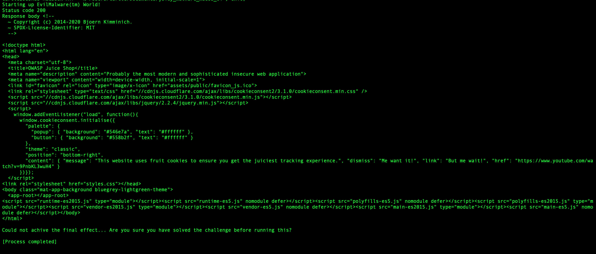
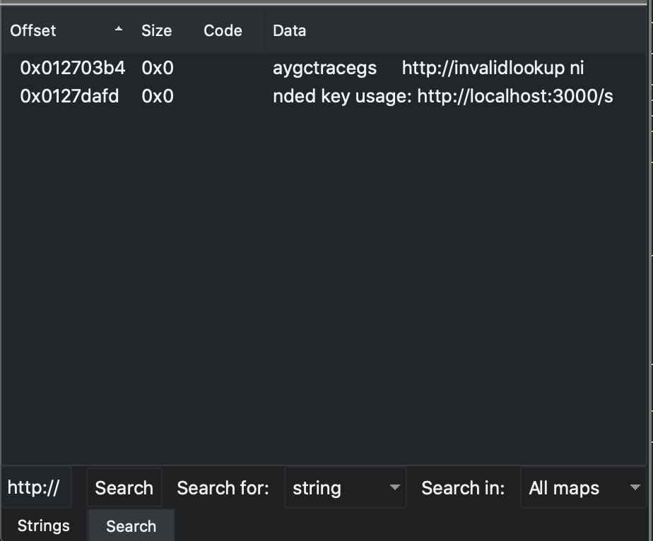
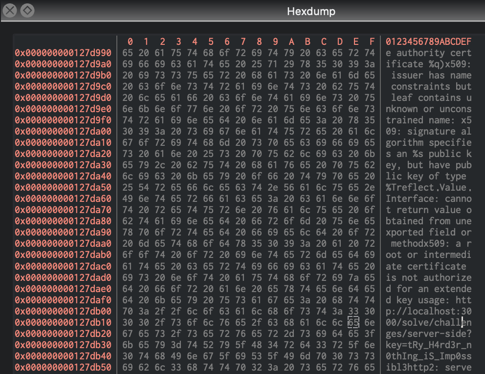
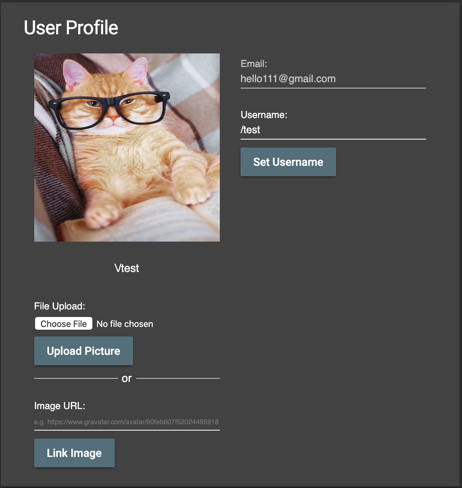
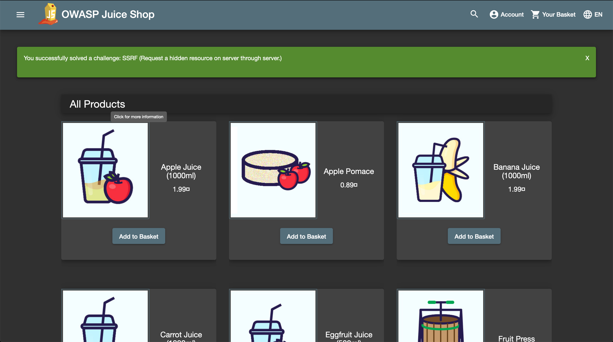

# Week 3 - SSRF and Reverse Engineering 

Sasha Thomas

April 20th 2020

## Introduction and Materials

This week, our task was to complete the SSRF juice shop challenge. I used Chrome, Firefox, and Cutter; an open source reverse engineering tool built on Radare2. 

More specifically, this challenge asks you to request a hidden resource on the server, through the server. To do so, you need to use the malware given to you from a previous challenge... Kind of. You can't use what you find directly inside the malware, as the challenge states. In order to make the juice shop server attack itself, you need to take the malware apart and use what you find inside, using "classic reverse-engineering" techniques. This one was hard. 

## Steps to Reproduce (Reverse Engineering)

1. Besides a basic understanding of what malware is, many of the definitions, ideas, concepts, and techniques in this lab were completely new to me. Since this lab is somewhat split up into two parts, I'll start with reverse engineering, as it took me the longest. If I felt like I was in the dark during the previous labs, navigating this felt like a black hole. The first thing I did was find as many resources as I could about reverse engineering; what it is, why, techniques, programs, etc. This was definitely a rabbit hole, and I spent a couple hours reading. I found a PDF of a popular intro to reverse-engineering book online, called [Practical Malware Analysis](https://github.com/braveghz/Practical-Malware-Analysis/blob/master/Practical_Malware_Analysis.pdf). I didn't have a lot of time, but I read through the parts that I figured would apply to what I was doing. 

2. From my research, the most popular tool to analyze malware was IDA Pro, which has a free version. Additionally, the juice shop malware which we needed to analyze wasn't difficult to find; it's located in juice shop's FTP server, not very well hidden in the about page. I downloaded IDA and the malware, and this is where my frustration began. I am not familiar with assembly, and not familiar with IDA. I did more research, and stumbled upon a similar application called [Cutter](https://cutter.re/), which looked friendlier to use. I was able to navigate Cutter much better, and starting looking for strings and functions which caught my attention.

3. At this point, I wasn't looking for anything specific. In order to get more information, I ran the malware (if this wasn't a juice shop lab, I would have set up a safe environment to do so). It is download as a `.txt` file, so I changed it to `.sh` and let it run. Here's what happened:

   

   It looked like it was receiving HTML, but I couldn't tell where it was requesting it from. This matched the functions I saw in cutter, there were dozens related to TCP, data frames, parsing headers, etc. 

4. My next idea was to look at the traffic coming in and out of my computer through Wireshark, and see if sniffing these packets out would result in anything. I tried multiple times, but never found anything concrete. In retrospect, it may be that it's receiving HTML from localhost:3000, where juice shop is running locally, and therefore would never need to leave my computer, so Wireshark might not be able to see that (but I'm not sure).

5. Since Wireshark wasn't effective, I went back to Cutter and kept analyzing. I tried searching for strings that might lead to any hints, links, anything to give me guidance. I still wasn't sure if I needed to modify the malware in any way, or if simply analyzing would lead me down the correct path. Eventually, I searched for strings containing `http`, and there were easily thousands of matches. I had already searched dozens of other strings that I felt could lead to something interesting, but after seeing that the malware had something to do with HTML, I figured `http` surely had something to do with it. I refined my search to `http://` out of curiosity, and got the two following results:

   

   `key usage` and `localhost:3000` definitely seemed like what I wanted. I'm not 100% sure about this, but I think these strings are hardcoded in the binary, which is why Cutter can see them. Assuming this was the case, I requested a hex dump and went to the location which contained this link. Within this mess, I spotted a sentence with a very obvious link:

   

   Towards the bottom, the link `http://localhost:3000/solve/challenges/server-side?key=tRy_H4rd3r_n0thIng_iS_Im0ssibl3` seemed like exactly what I was looking for. 

## Steps to Reproduce (SSRF)

1. In between using Cutter to analyze the malware, I also looked into SSRF and where on juice shop I could find this vulnerability. From my research, SSRF can occur when a server performs arbitrary requests on the behalf of an attacker. It could be HTTP requests, but it has the potential to be any modified URL, including those requesting files with `file:///`. This allows the attacker to elevate their privileges, because it is no longer them requesting the file, or the site. Since the server is making the requests on the attacker's behalf (if not mitigated correctly), the attacker could even gain access to internal services which aren't intended to be exposed. 

2. I clicked around juice shop looking for a place where juice shop makes a request for you, and I found one fairly quickly, in my profile:

   

   If you want to upload an image from a website, you can do so using Link Image. Inspecting the network tab while uploading an image, I observed that the site makes a post request to `/profile/image/url`, with a key `imageUrl` set to whatever I supply.

3. I tried some different URL's to see what would happen, but I ran into weird SQLite errors, such as "blocked illegal activity." I wasn't able use `file:///`, possibly because juice shop is being run locally on a docker container, I'm not sure. However, I did notice that my browser never made a request to a website with an image, yet this lovely cat was now my profile. Either the server makes a request to the URL every time I ask it to display my profile, or the server itself downloads the image. If it was the latter, then anything malicious I supplied it would be downloaded and run by the server. 

4. After I found the link in cutter, I pasted it into the link image field. My goal was still to request a hidden resource on the server, and if I didn't have the authorization to do this, the server definitely did. Now that I knew where the hidden resource was, I used the server to request it and solved the challenge:

   

## Results and Discussion

Even though I solved the challenge, I don't feel 100% satisfied; this really showed me how little I know. I never made any significant breakthroughs, I eventually just stumbled onto the right string. It seems like knowledge of assembly and lower-level programming languages would also really help here (which I don't have). I was able to find the SSRF vulnerability too, but this also didn't feel 100% satisfying because it wasn't very well hidden. 

I definitely feel more comfortable with SSRF and think this was a good introduction to it. Additionally, I feel a little more knowledgable about reverse engineering, but it's clear that I need much more foundational-level knowledge before I can really start to understand it. Because the key was hidden in a string, I just needed to get lucky and search for the correct term. 

## Conclusion

In conclusion, this lab absolutely pushed my limits. I'm not sure I solved it the intended way, but it was an excellent hunt, and forced me to use programs and learn things things I wasn't aware of. The day of writing this, I stumbled upon a unix command which I didn't know about, called `strings`, which returns the raw strings written in the binary of an executable. Out of curiosity, I ran `strings` with the juice shop malware, and grepped a couple search words to see what would happen. Of course, this gave me the same link I found in Cutter (which makes sense, it's the same binary):

This would have potentially saved me hours, although I wouldn't have gotten to know Cutter as well. In the future, I will keep this in mind as a good starting step when analyzing a program.