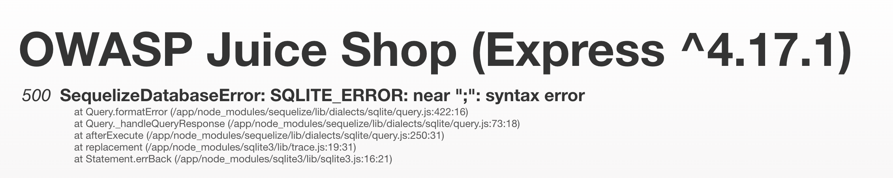
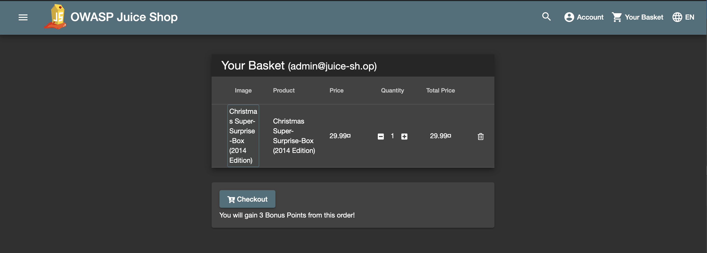

# Week 1 - Blind SQL Injection

Sasha Thomas

April 5th 2020

## Introduction and Materials

Blind SQL injection is the process of asking a database true or false questions and extracting information from the way it responds. According to OWASP, this attack is often used when a web application is configured to show generic error messages, but hasn't mitigated the code that is vulnerable to SQL injection. 

This lab's purpose is to use blind SQL injection within OWASP juice shop. I used chrome and firefox to complete it. The specific challenge I did, [**order the Christmas special offer of 2014**](https://bkimminich.gitbooks.io/pwning-owasp-juice-shop/content/part2/injection.html), asks you to order a product that isn't supposed to be available anymore. 

## Steps to Reproduce

1. I first wanted a better idea as to how search queries worked for each product. After entering a generic search term ("apple"), and examining the network tab, I found an interesting resource containing JSON called `search?q=`. This file contained what I assumed was the list of available products.  For example, the result of entering "apple juice" would return the following:

   ```json
   {
   status: "success",
     data: [
       {
         id: 1,
         name: "Apple Juice (1000ml)",
         description: "The all-time classic.",
         price: 1.99,
         deluxePrice: 0.99,
         image: "apple_juice.jpg",
         createdAt: "2020-04-05 20:37:52.160 +00:00",
         updatedAt: "2020-04-05 20:37:52.160 +00:00",
         deletedAt: null
       }
     ]
   }
   ```

2. Upon examining this, the most interesting key was `deletedAt`, as I was searching for something that was deleted. It seemed like the backend hid deleted products by only pulling those where `deletedAt` is set to `null`, because this was true for every product I could see. This meant that I first needed to find where the application was vulnerable to injection, and then create a SQL string that pulls products where `deletedAt` is not set to `null`, or comment out that part of the code. 

3. Finding the vulnerable part of the application took me the longest amount of time, as I incorrectly assumed it was the search bar. I searched for strings such as `;` and `';` in hopes that it would make juice shop throw an error, but I hit a wall. I eventually retraced my steps and looked back at the JSON, to see where it was getting this information from. I found that the request URL was through `/rest/products/search?q=`. Hitting this in my browser brought me directly to their backend. When I searched for the same strings here, I was met with a SQLite error:

   

4. At this point I was at the blind injection part. After some random attempts to get anything besides a syntax error, I found that adding a comment (`search?q='--`) gave me an `incomplete input` error. I googled this, and the majority of stack overflow fixes were closing a missing parenthesis. I tried one parenthesis, and got the same error, and then tried two, which worked. My query at this point was `search?q='))--`. Entering this string returned all products, including those which weren't available in the front end. In retrospect, since I could actually see all the products, I didn't need to do anything else, but I incorrectly assumed that I still needed to grab the deleted products. After some toying around, my final query was `search?q=' AND deletedAt IS NOT null))--`, which returned this:

   ```json
   {
   	status: "success",
   	data: [
   		{
         id: 10,
         name: "Christmas Super-Surprise-Box (2014 Edition)",
         description: "Contains a random selection of 10 bottles (each 500ml) of our tastiest juices and an extra fan shirt for an unbeatable price! (Seasonal special offer! Limited availability!)",
         price: 29.99,
         deluxePrice: 29.99,
         image: "undefined.jpg",
         createdAt: "2020-04-05 20:37:52.163 +00:00",
         updatedAt: "2020-04-05 20:37:52.163 +00:00",
         deletedAt: "2014-12-27 00:00:00.000 +00:00"
      ]
   }
   ```

5. Success! But I wasn't finished; I still needed to figure out how to get this product in my basket, and order it. Looking at every product in the backend, I noticed they each had a unique ID. I figured that this ID might be used when you add a product to your basket. Going back to the front end and examining the network tab, when I added a product to my basket, a POST request was made with the keys `productId`, `BasketId`, and `quantity`. The `ProductId` key matched the ID of the product that I saw on the backend.
6. The last step was to send my own POST request that contained the product ID of the Christmas special offer. I think I can use Burp to do this, but I know that Firefox lets you edit and resend requests, so I just used that. I changed the request to `{"ProductId": 10, "BasketId": "1", "quantity": 1}`, and refreshing the page resulted in the following:

7. Now that I forced it into my cart, I could follow the standard checkout procedures and "order" it.


## Results and Discussion

To me, this is an example of how security is only as strong as its weakest link. Though it seemed like they had security controls for the search bar, having direct access to the unsecure back-end meant those front-end security controls were basically useless. 

Additionally, I was able to do the blind SQL injection because the backend didn't properly handle errors. Even if it was still vulnerable to injection, it would have been much harder to find the correct string if I couldn't see the errors. 


## Conclusion

The main conclusion I can draw from this lab is that even if something is secure, if where this information is coming from isn't secure, it nullifies any of those mitigations. 

As far as technical skills, I feel more comfortable using errors and behavior to help me alter a malicious string. I can see how this could be applied in much more complex ways, as I didn't need to ask it true/false questions and observe its behavior based on those; I only looked at the behavior based on my string. 

