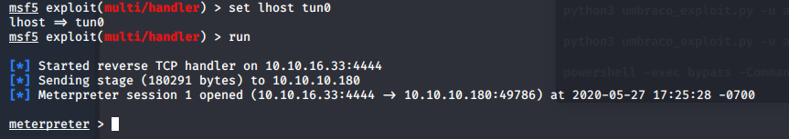

# Week 5 - HackTheBox OpenAdmin Write-up 

Sasha Thomas

May 4th 2020

## Introduction and Materials

This week, I decided to try to get a flag on an "easy" HTB challenge. The box I chose is called OpenAdmin, one of the few retired boxes which is still available for free users. 

To complete this lab, I used Nmap, DirBuster, Metasploit, John the Ripper, and Firefox. 

## Steps to Reproduce

1. As I have learned from previous labs, enumeration is usually the first step. After I connected to the HTB VPN, I ran an Nmap scan on the box's IP, `10.10.10.171`. The command I ran was `nmap -sV -v 10.10.10.171`, which gave me the following results:

   


2. Port 80 and 22 are fairly standard (as far as I'm aware), so nothing stuck out to me here. Seeing that port 80 was open, hitting that in my browser brought me to the default Apache2 Ubuntu page:

   

   I glossed over this page, but in retrospect, it would have given me a number of clues later in the lab.  Regardless, I was stuck here for a little. What can I do with just a default page? After doing research, I found a program in Kali called DirBuster, which will brute force directories and file names on web/application servers. I chose a random word-list (which came with DirBuster), and gave it a few minutes. It was able to find a couple dozen files and directories:

   

3. The three directories DirBuster was able to find were `/icons/`, `/music/`, and `/ona/`. As icons and music didn't exactly appeal to me, I decided to look into `/ona/`. Hitting this in my browser brought me to an interesting page:

   

   I've never heard of OpenNetAdmin, but a quick Google search told me it was a system for tracking IP network attributes in a database. I figured I was on the right track because of the yellow warning stating that ONA is not on the latest release version. Googling "OpenNetAdmin v18.1.1 exploit" gave me an exploit for this exact version, I just needed to figure out how to use it.

4. My only experience using exploits has been through Metasploit. I tried downloading the exploit through exploit-db, but I wasn't able to get it to run, so I reverted back to Metasploit. Using Metasploit, I got a little farther, but ended up with a weird error and no meterpreter session. The only variables I needed to set were `LHOST` and `RHOSTS` according to the `options`. I set `LHOST` to `tun0`, the interface for the VPN, and set `RHOSTS` to `10.10.10.171`, but was stuck with the following error:

   

   Because this error was so generic, it was difficult to find answers online. Eventually, I looked at this [Rapid7 article](https://metasploit.help.rapid7.com/docs/working-with-payloads) about Metasploit payloads, which described how Metasploit will automatically select a payload for you. According to this, the first payload it sends is `/windows/meterpreter/reverse_tcp`. If this was true, then this is potentially the problem, because from my Nmap scan, I knew I was attacking a linux machine. Using the `show payloads` command, I switched the payload to `linux/x64/meterpreter/reverse_tcp`, and this finally got me a meterpreter shell, as a low-privilege user "www-data":

   

5. I found myself in the directory `/opt/ona/www`, which had tons of files and directories:

   

   This is the first place I was truly stuck on (more than an hour). What can I do here? In retrospect, I spent too much time outside of this initial directory. In the excitement of being able to snoop around this box, I lost direction. Eventually, I started to enumerate as much as I could of this initial directory, because I couldn't find much anywhere else. The first time I looked at this directory, I only enumerated `login.php` and `logout.php`, in hopes for plaintext credentials. My mistake was not looking further into this directory. When I came back, I started looking at any config files I could find. Eventually, I went into the `local` directory, which had it's own `config` folder. Inside that, I found an interesting file named `database_setting.inc.php`. This seemed important. `cat`'ing this, I actually found a plaintext password:

   

   Amazing! But what is this a password for? I was admittedly stuck here for a while. I tried looking for anything I could log into on the website, but no dice. I dug around in the box more, and realized one big thing I forgot to enumerate in the beginning: the users of the computers. I found there were two: jimmy, and joanna. As a last-ditch effort, I thought maybe this password might have been reused, but I couldn't figure out how to switch users from my meterpreter session. 

6. I was wayyy over-thinking this; I just needed to `ssh` into `user@10.10.10.171` and see if this password worked. It didn't work for joanna, but it did work for Jimmy!

   

   In HTB, one flag is given for owning a user, and another for root. I incorrectly assumed this user would give me the user flag, but it wasn't here. After, I spent upwards of 2-3 hours trying to switch from jimmy to joanna. In retrospect, having rooted the box, I can definitely say that switching users was much harder than getting root (which I don't think is "normal"). 

7. None of the techniques and tips I found online for privilege escalation helped me. A video recommended that I learn more about the OS and see if there were exploits that could help me, but I couldn't find any. After a few hours, I decided just to enumerate more, but instead of looking around aimlessly, I wanted to know more about Apache2 (according to `nmap`, this is what it was using for hosting). After some google searches about Apache2, I found it's default file structure, and started looking through `/etc/apache2`. the `apache2.conf` file didn't give me any hints, but there were two unique folders in the same directory, titled `sites-available` and `sites-enabled`, which had their own respective config folders. Enumerating through these, I eventually found `internal.conf`, and `cat`'ing this gave me some interesting information:

   

   

   Seeing the userID joanna was a big hint that this was important, as well as something being run internally on 127.0.0.1 on port 52846. Since this is such a weird port, this is definitely supposed to be hidden. If the document root was at `/var/www/internal`, I decided to go look at this directory. Inside were three files, `index.php`, `logout.php`, and `main.php`. `cat`'ing each of these I found a very obvious hint in `main.php`:

   

   "`Don't forget your 'ninja' password`" is a nod to the password I used to get into jimmy's account (n1nj4W4rri0R!), so I was really excited to see this. I also noticed that the output is catting joanna's `ssh` key, so I somehow needed to access this internal website.

8. How do I see an internal website? This took some thinking. Having accessed Jimmy's account on the box, I knew that I could interact with the internal site through the shell (as opposed to the web browser). A command I learned in the INFO networking class is `curl`, which allows you to (among a bunch of things) make GET requests from the command line. I mistakenly tried to `curl` the box's IP for the first couple tries, before realizing I should be `curl`ing the local IP and port. Once I realized this, `curl 127.0.0.1:52846/main.php` gave me an interesting RSA key:

   

9. Since this key is from the `cat /home/joanna/.ssh/id_rsa` command, if I was able to crack this, then I should be able to log into joanna. The password cracker that I've heard about repeatedly is John the Ripper. It took me about 30 minutes to figure out how to use it correctly, because I kept running into errors and needing to troubleshoot. Eventually, I converted this into a format John could understand, and let it run. 

10. In less than a minute, John was able to crack it (the wordlist I used was rockyou.txt), but I was confused by how John gives the result to you. John gives you the password to the RSA key, but I mistakenly took this as her `ssh` password. When it didn't work, I was quite confused. After a few minutes, I realized what was happening, and `ssh`'d into `joanna@10.10.10.171` using this RSA key and the password John gave me (which was "`bloodninjas`"):

    

11. Within joanna's home directory, I found the hash for the flag, and submitted it. But I still wanted to root the box, so I kept going. When I was stuck enumerating previously, I ended up doing a lot of research about privilege escalation in linux. One of the things I repeatedly came across was abusing the sudo rights of the user. Linux allows users to `sudo` certain commands, and these can often be exploited to gain root access to the box. A website recommended by most of the articles I read is [GTFOBins](https://gtfobins.github.io/), which is a curated list of Unix binaries that can be used to bypass local security restrictions. When I was searching through the box initially, one of the places I looked at was the `sudoers.d` folder, and found that joanna had the following sudo rights:

    

    When I looked on GTFOBins, I found that they had an exploit for when the user is given `sudo` rights to `nano` with no password, exactly what Joanna could do. Joanna can only use `sudo nano` on `/opt/priv`, but that doesn't matter, the exploit will still give me a root shell.  I `cd`'ed into `/opt/priv` and entered the following (from GTFOBins):

    ```bash
    sudo nano
    ^R^X
    reset; sh 1>&0 2>&0
    ```

    To be honest, I have no idea why this works, but it did in fact give me a root!!

    


## Results and Discussion

This lab took me an entire weekend, but I'm really happy to say I owned both users and root. Even though this is considered the easiest box on HTB, and required no custom exploitation, I'm happy to be at a level where I can struggle, but eventually find my way. 

In terms of what I learned, enumeration for this was key. Without searching and finding everything I was given, I couldn't have found the things that were hidden in the files. I will tackle further challenges with the mindset of enumerating as much as I can (or at least, the things which are relevant to what I'm attacking, such as config files, Apache folders, etc.)

## Conclusion

There were many security principles violated, but I think this is the most realistic "hack" I've done, in the sense that there were mitigations in place, and the ways around them weren't as obvious as JuiceShop or HackerOne (although, it's hard to compare, because this isn't web focused). This lab was also fun because I was able to use programs I've never used before, like DirBuster and John the Ripper, and got more experience with Metasploit. I'm incredibly happy with the results of this lab, and I'm excited to keep learning more. 
